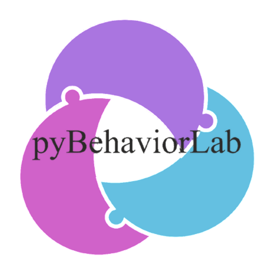

# pyBehaviorLab

<div class="pbl-hero">
<picture>
  <source media="(prefers-reduced-motion: reduce)"
          srcset="_static/logo-anim-still.png" type="image/png">
  <source srcset="_static/logo-anim.webp" type="image/webp">
  
</picture>
<p><b>pyBehaviorLab is a desktop application for running behavioural
experiments in operant chambers and maze arenas.</b><br>
Each experiment runs as a state machine on a pyControl
microcontroller, so event timing is independent of the host
computer. Recording, pose tracking and zone scoring run beside it on
the host and return the animal's position to the task while the
session is under way, so what the task does next can depend on where
the animal is. One box and a hundred are described the same way.</p>
</div>

## Start here

Each path below opens with the install it needs, then lists the parts and the
pages in the order they are used. Choosing a rig in the sidebar keeps that
answer with you on every page.

::::{grid} 1 2 2 2

:::{grid-item-card} {octicon}`cpu;1.5em;sd-text-primary` Operant chamber, no camera
:link: getting-started
:link-type: doc
**Install:** [application](installation.md#install-the-application) then
[microcontroller](installation.md#prepare-the-microcontroller).

The microcontroller runs the task on its own: pokes, lights, reward, audio. **No GPU
is needed.**

*Install → first project → write a task → upload and run.*
:::

:::{grid-item-card} {octicon}`device-camera-video;1.5em;sd-text-primary` Operant chamber with video
:link: user-guide/recording
:link-type: doc
**Install:** [application](installation.md#install-the-application) then
[microcontroller](installation.md#prepare-the-microcontroller). No extra stack.

The same task, with video recorded alongside it for later scoring. The camera
is only written to disk, so **no GPU is needed.**

*Add a camera → set the region → record with the session.*
:::

:::{grid-item-card} {octicon}`pulse;1.5em;sd-text-primary` Operant chamber with pose tracking
:link: user-guide/tracking
:link-type: doc
**Install:** application, microcontroller, then the
[pose stack](installation.md#add-pose-estimation) and
[verify](installation.md#verify) it.

The host tracks the animal during the session and sends coordinates and zone
entries to the task, which can then respond to position. **A CUDA GPU is
required.**

*Camera → model → zones → coordinates in the task.*
:::

:::{grid-item-card} {octicon}`git-merge;1.5em;sd-text-primary` Maze arena
:link: user-guide/setup-cameras-tracking-zones
:link-type: doc
**Install:** the same as pose tracking, including the
[pose stack](installation.md#add-pose-estimation).

One camera per arena. The animal's position drives the task, so the
**requirements match pose tracking above**, as do most of the pages.

*Camera → model → arms as zones → maze task.*
:::

::::

## Reference

::::{grid} 1 2 3 3

:::{grid-item-card} {octicon}`rocket;1.5em;sd-text-primary` Introduction
:link: introduction
:link-type: doc
What the platform is, and the pipeline at a glance.
:::

:::{grid-item-card} {octicon}`download;1.5em;sd-text-primary` Installation
:link: installation
:link-type: doc
The application, the microcontroller, the pose runtime, and how to check each.
:::

:::{grid-item-card} {octicon}`device-desktop;1.5em;sd-text-primary` GUI tour
:link: user-guide/gui-tour
:link-type: doc
Every tab and dialog, and what each control does.
:::

:::{grid-item-card} {octicon}`pencil;1.5em;sd-text-primary` Writing tasks
:link: tasks/writing-tasks
:link-type: doc
The state machine, driving it from pose, and the config files.
:::

:::{grid-item-card} {octicon}`cpu;1.5em;sd-text-primary` Hardware
:link: hardware/breakout
:link-type: doc
The breakout board, its ports and pin map, and the peripherals.
:::

:::{grid-item-card} {octicon}`tools;1.5em;sd-text-primary` Build a maze
:link: hardware/operant-chamber
:link-type: doc
Arm modules, carriage, belt, end stops, and the powered checks.
:::

:::{grid-item-card} {octicon}`meter;1.5em;sd-text-primary` Performance
:link: reference/performance
:link-type: doc
Latency, timing accuracy, tracking validation, and the known limits.
:::

:::{grid-item-card} {octicon}`git-branch;1.5em;sd-text-primary` Concepts
:link: concepts/frame-pipeline
:link-type: doc
How the pieces fit: frame pipeline, tracking, time sync, lineage.
:::

:::{grid-item-card} {octicon}`code;1.5em;sd-text-primary` API reference
:link: api/index
:link-type: doc
What a task can call, what tracking adds, and the project schema.
:::

:::{grid-item-card} {octicon}`question;1.5em;sd-text-primary` Troubleshooting
:link: troubleshooting
:link-type: doc
The common serial, camera and upload failures, and what fixes them.
:::

::::

```{toctree}
:hidden:
:caption: Get started

introduction
installation
getting-started
architecture
```

```{toctree}
:hidden:
:caption: 1 · Set up the experiment

user-guide/gui-tour
user-guide/projects
```

```{toctree}
:hidden:
:caption: 2 · Write the task

tasks/writing-tasks
tasks/configs
tasks/task-api
tasks/recipes
```

```{toctree}
:hidden:
:caption: 3 · Run it

user-guide/boards
user-guide/setup-cameras-tracking-zones
user-guide/cameras
user-guide/tracking
user-guide/recording
```

```{toctree}
:hidden:
:caption: 4 · Read the results

user-guide/stats
user-guide/analysis
user-guide/api-class
```

```{toctree}
:hidden:
:caption: Hardware

hardware/breakout
hardware/peripherals
hardware/operant-chamber
hardware/audio
hardware/microphone
hardware/photometry
```

```{toctree}
:hidden:
:caption: Concepts

concepts/project-vs-run
concepts/snapshot-tracking
concepts/frame-pipeline
concepts/tracking-pipeline
concepts/time-sync
concepts/run-lineage
```

```{toctree}
:hidden:
:caption: Reference

reference/file-formats
reference/performance
reference/settings
reference/env-vars
reference/glossary
```

```{toctree}
:hidden:
:caption: API

api/index
api/config-schema
api/pipeline
api/pycboard
api/recorder
api/trackers
api/gui
```

```{toctree}
:hidden:
:caption: Development

dev/module-map
dev/environment
dev/testing
dev/build-cython
dev/contributing
dev/camera-modes-and-rates
```

```{toctree}
:hidden:
:caption: Project

troubleshooting
```

