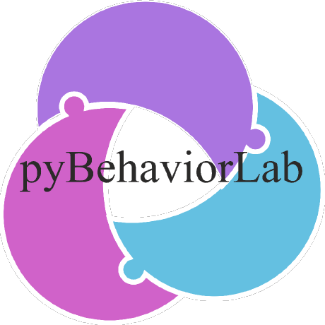

# Introduction

<div class="pbl-hero">

<p>A single-process application for <b>operant setup</b> and <b>fully automated mazes</b>
multi-box control, live video tracking, position feedback built on
<b>pyControl</b> and MicroPython.</p>
</div>

## Hardware compatibility

**Every pyControl hardware setup already in your lab works with this software
unchanged.** The firmware in `source/pyControl/` is the pyControl framework, the
drivers in `devices/` are the pyControl device drivers, and
`hardware_definitions/` uses the same pin-map format, so an existing breakout
board, an existing hardware definition and an existing task run here as they do
now. No re-wiring, no re-flashing to a different framework, no porting.

Boards: the **breakout 1.0**, **1.2**, **F767** and **F767 v2**, plus the
Nucleo connector and the port expander.

Devices, all with their existing drivers: pokes (single, five-poke, nine-poke),
lickometers, solenoid drivers, LED drivers and analog LEDs, stepper motors
(including TMC), doors, rotary encoders, load cells, Schmitt triggers, uRFID,
audio (audio board, audio player, PCM5102, TAS5825M, I2S), photometry
(acquisition and pyPhotometry board), the ESP microphone, MCP and UART
handlers, and the frame logger / frame trigger.

What this software adds sits *beside* that, not in place of it: video capture,
tracking, and coordinate and zone pushes into the running task.

::::{grid} 1 2 2 4

:::{grid-item-card} {octicon}`stack;1.3em;sd-text-primary` Multi-box control
Up to 16 boxes in one window, each with its own microcontroller.
:::

:::{grid-item-card} {octicon}`device-camera-video;1.3em;sd-text-primary` Live tracking
DeepLabCut & SLEAP, frame-accurate and time-aligned.
:::

:::{grid-item-card} {octicon}`zap;1.3em;sd-text-primary` Position in the task
Zones & coordinates pushed to the firmware in real time.
:::

:::{grid-item-card} {octicon}`graph;1.3em;sd-text-primary` Real-time stats
Per-box accuracy, reversals and rewards as they happen.
:::

::::

## What the platform contributes

The components of a pose-resolved behavioural experiment are mature, and none of
them is reimplemented here. Pose estimation is **DeepLabCut** and **SLEAP**,
online inference is **DeepLabCut-Live!**, and the task framework and syntax extend
**pyControl**.

What pyBehaviorLab provides is their **integration**:

- **one sync timestamp** on every frame and every event;
- **one frame stream** feeding recording and inference;
- **one stored configuration** binding the task, the hardware definition, the
  zones and the trigger rules.

Fixing these in the platform makes them properties of the *system* rather than of
a particular installation, which is what lets them be stated, carried between
laboratories, and measured.

The practical consequence is that a zone entry reaches the state machine exactly
as a sensor input does. A task can read the zone a tracked point occupies as an
task variable and act on a zone change in the same state block that closes a
door; **a zone entry and a beam break are indistinguishable from within the
task**.

## Two ways to work

Because a controller timestamp accompanies every frame, one acquisition serves
both:

| | Online | Offline |
|---|---|---|
| **Pose computed** | During the session | Afterwards, over the complete recording |
| **Use when** | The task must react to the animal, closing a door, releasing reward, triggering stimulation | No component acts on posture during the session |
| **Frame coverage** | Skips frames under load, and logs every skip | Every frame |
| **Scales to** | One apparatus reacting in real time | Many setups recorded together |

Nothing is lost by the offline route, provided the images carry the same sync
timestamp as the behaviour, the two then remain exactly aligned. See
[The frame pipeline](concepts/frame-pipeline.md#what-each-consumer-does-when-it-falls-behind).

## Overview

pyBehaviorLab drives both **operant chambers** (many boxes, cameras optionally shared with per-box
ROI cropping) and **maze arenas** (one camera per arena). The two entry points load the identical
`source/` package, only the per-mode main window differs:

- `python pyOperant.py`, operant chambers (multi-box).
- `python pyMaze.py`, maze arenas (one camera per arena).

The system spans two runtimes. The **host** (CPython 3.9+/PySide6) runs the GUI, the video pipeline
and the serial link. Each box's **microcontroller** (MicroPython on an STM32 Nucleo) runs the
experiment as a pyControl state machine. The host uploads the firmware, hardware definition and task
over serial, then streams events back, video, tracking and firmware events share one sync
timestamp, so everything aligns offline. Concurrency is strictly per-box: each box owns its board and its tracking,
and master buttons fan out across boxes.

```{mermaid}
flowchart LR
  A["pyOperant.py"] --> C
  B["pyMaze.py"] --> C
  C["MainWindowBase<br/>(shared engine)"] --> D["Video pipeline<br/>camera · tracking · recording"]
  C --> E["pycboard<br/>MCU serial"]
  E --> F["STM32 Nucleo<br/>pyControl task"]
  D -. "coords · zone events" .-> E
  classDef hl fill:#efeafd,stroke:#5b4bd6,color:#2b2340;
  class C,D,E hl;
```

The video **pipeline** is one object that owns the whole path, a camera thread per physical camera,
a frame bus that fans each batch out (with per-box ROI cropping for shared cameras), and four
consumers: a lossless recorder, a pose estimator and an MCU pusher. Every recorded
video is paired with a per-frame `_video_data.txt` carrying MCU firmware time, so behaviour and video
line up offline. See [The frame pipeline](concepts/frame-pipeline.md) and
[Time synchronisation](concepts/time-sync.md).

## Where to go next

::::{grid} 1 2 2 3

:::{grid-item-card} {octicon}`play;1.4em;sd-text-primary` Getting started
:link: getting-started
:link-type: doc
Install (uv/venv/conda + GPU), launch, and your first recording.
:::

:::{grid-item-card} {octicon}`device-desktop;1.4em;sd-text-primary` GUI tour
:link: user-guide/gui-tour
:link-type: doc
The four operant tabs, the maze window and the end-to-end workflow.
:::

:::{grid-item-card} {octicon}`cpu;1.4em;sd-text-primary` Hardware
:link: hardware/breakout
:link-type: doc
The V2 Nucleo breakout, motors & doors, audio, mic and photometry.
:::

:::{grid-item-card} {octicon}`pencil;1.4em;sd-text-primary` Writing tasks
:link: tasks/writing-tasks
:link-type: doc
Build a pyControl state machine, drive audio, and use zones.
:::

:::{grid-item-card} {octicon}`git-branch;1.4em;sd-text-primary` Concepts
:link: concepts/frame-pipeline
:link-type: doc
How the pieces fit, pipeline, tracking, time-sync, lineage.
:::

:::{grid-item-card} {octicon}`code;1.4em;sd-text-primary` API reference
:link: api/index
:link-type: doc
What a task can call, what tracking adds, and the project schema.
:::

::::

## Downloads

Three repositories build and run a complete rig:

::::{grid} 1 3 3 3

:::{grid-item-card} {octicon}`code;1.2em;sd-text-primary` code
:link: https://github.com/pyBehaviorLab/code
Application, firmware, tasks, tools.
:::

:::{grid-item-card} {octicon}`cpu;1.2em;sd-text-primary` hardware
:link: https://github.com/pyBehaviorLab/hardware
PCB design files for the breakout & peripheral boards.
:::

:::{grid-item-card} {octicon}`package;1.2em;sd-text-primary` cad_designs
:link: https://github.com/pyBehaviorLab/cad_designs
3D-printable / machined enclosure & maze designs.
:::

::::
